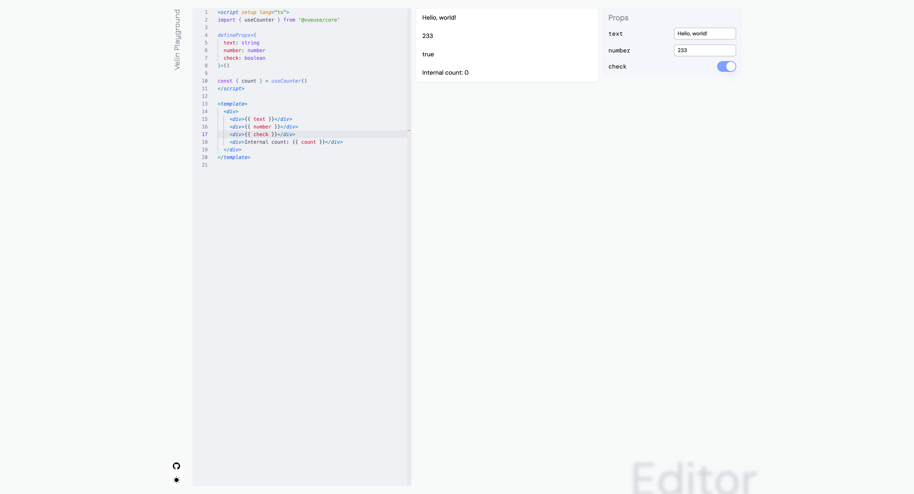

# Velin

[![npm version][npm-version-src]][npm-version-href]
[![npm downloads][npm-downloads-src]][npm-downloads-href]
[![bundle][bundle-src]][bundle-href]
[![JSDocs][jsdocs-src]][jsdocs-href]
[![License][license-src]][license-href]

> Have you wondered how it feels if you can develop the prompts of agents and MCP servers with the power of Vue or React?

Develop prompts with Vue SFC, React components, TSX/JSX source, or Markdown like a pro.

<!-- START doctoc generated TOC please keep comment here to allow auto update -->
<!-- DON'T EDIT THIS SECTION, INSTEAD RE-RUN doctoc TO UPDATE -->
## Table of Contents

- [Framework Support](#framework-support)
- [Quick Start](#quick-start)
- [Features](#features)
- [How it feels](#how-it-feels)
- [Similar projects](#similar-projects)
- [Development](#development)
- [License](#license)

<!-- END doctoc generated TOC please keep comment here to allow auto update -->

## Framework Support

<p align="center">
  <a href="https://vuejs.org/">
    
  </a>
  &nbsp;&nbsp;&nbsp;&nbsp;
  <a href="https://react.dev/">
    
  </a>
  &nbsp;&nbsp;&nbsp;&nbsp;
  <a href="https://svelte.dev/">
    
  </a>
</p>

<p align="center">
  <strong>Vue</strong> supported
  &nbsp;&nbsp;&nbsp;&nbsp;
  <strong>React</strong> supported
  &nbsp;&nbsp;&nbsp;&nbsp;
  <strong>Svelte</strong> in progress
</p>

We got a playground too, [check it out](https://velin.dev):

<p align="center">
  <picture>
    <source
      srcset="./docs/assets/dark-playground.png"
      media="(prefers-color-scheme: dark)"
    />
    <source
      srcset="./docs/assets/light-playground.png"
      media="(prefers-color-scheme: light), (prefers-color-scheme: no-preference)"
    />
    
  </picture>
</p>

## Quick Start

Try it by running following command under your `pnpm`/`npm` project.

```bash
# For browser users
npm i @velin-dev/vue
npm i @velin-dev/react

# For Node.js, CI, server rendering and backend users
npm i @velin-dev/core-vue
npm i @velin-dev/core-react
```

## Features

- No longer need to fight and format with the non-supported DSL of templating language!
- Use HTML elements like `<div>` for block elements, `<span>` for inline elements.
- Directives with native Vue template syntax, such as `v-if` and `v-else`.
- React component rendering with Node.js and browser-compatible entry points.
- Trusted TSX/JSX source loading for React prompt components.
- Compositing other open sourced prompt components or composables over memory systems.

All included...

## How it feels

### Vue SFC

```html
<!-- Prompt.vue -->
<script setup lang="ts">
defineProps<{
  name: string
}>()
</script>

<template>
  <div>
    Hello world, this is {{ name }}!
  </div>
</template>
```

#### In Node.js

```ts
import { readFile } from 'node:fs/promises'

import { renderSFCString } from '@velin-dev/core-vue'
import { ref } from 'vue'

const source = await readFile('./Prompt.vue', 'utf-8')
const name = ref<string>('Velin')
const { rendered } = await renderSFCString(source, { name })

console.log(rendered)
// Hello world, this is Velin!
```

#### In Vue / Browser

```vue
<script setup lang="ts">
import { usePrompt } from '@velin-dev/vue'
import { ref, watch } from 'vue'

import Prompt from './Prompt.vue'

const name = ref<string>('Velin')
const { prompt } = usePrompt(Prompt, { name })

watch(prompt, () => {
  console.log(prompt)
  // Hello world, this is Velin!
})
</script>
```

### React component

```tsx
import { renderComponent } from '@velin-dev/core-react'

function Prompt({ name }: { name: string }) {
  return (
    <article>
      <h1>{`Hello ${name}`}</h1>
      <p>Render React components as Markdown prompts.</p>
    </article>
  )
}

const markdown = await renderComponent(Prompt, { name: 'Velin' })

console.log(markdown)
// # Hello Velin
//
// Render React components as Markdown prompts.
```

#### In React / Browser

```tsx
import { usePrompt } from '@velin-dev/react'

function Prompt({ name }: { name: string }) {
  return <div>{`Hello ${name}`}</div>
}

function PromptPreview() {
  const { prompt, rendering, dispose } = usePrompt(Prompt, { name: 'Velin' })

  return (
    <>
      <pre>{rendering ? 'Rendering...' : prompt}</pre>
      <button type="button" onClick={dispose}>Dispose</button>
    </>
  )
}
```

#### From trusted TSX/JSX source

```ts
import { renderComponent } from '@velin-dev/core-react'
import { componentFromSource } from '@velin-dev/source-react'

const Prompt = await componentFromSource<{ name: string }>(`
  export default function Prompt({ name }: { name: string }) {
    return <div>Hello {name}</div>
  }
`)

const markdown = await renderComponent(Prompt, { name: 'Velin' })
```

`componentFromSource` and `componentFromFile` evaluate transformed ESM and are not a sandbox or security boundary. Use them only with trusted source.

## Similar projects

- [poml](https://github.com/microsoft/poml) / [pomljs](https://github.com/microsoft/poml)

## Development

### Clone

```shell
git clone https://github.com/moeru-ai/velin.git
cd velin
```

### Install dependencies

```shell
corepack enable
pnpm install
```

> [!NOTE]
>
> We would recommend to install [@antfu/ni](https://github.com/antfu-collective/ni) to make your script simpler.
>
> ```shell
> corepack enable
> npm i -g @antfu/ni
> ```
>
> Once installed, you can
>
> - use `ni` for `pnpm install`, `npm install` and `yarn install`.
> - use `nr` for `pnpm run`, `npm run` and `yarn run`.
>
> You don't need to care about the package manager, `ni` will help you choose the right one.

```shell
pnpm dev
```

> [!NOTE]
>
> For [@antfu/ni](https://github.com/antfu-collective/ni) users, you can
>
> ```shell
> nr dev
> ```

### Build

```shell
pnpm build
```

> [!NOTE]
>
> For [@antfu/ni](https://github.com/antfu-collective/ni) users, you can
>
> ```shell
> nr build
> ```

### Documentation

The table of contents above is generated with `doctoc`, following the same README maintenance pattern used in `moeru-ai/alint`. Run this after changing README headings:

```shell
pnpm docs:update
```

`docs:update` refreshes the root README TOC. Velin keeps package-level READMEs separate because each published package documents a different framework or runtime entry point.

## License

MIT

[npm-version-src]: https://img.shields.io/npm/v/@velin-dev/core-vue?style=flat&colorA=080f12&colorB=1fa669
[npm-version-href]: https://npmjs.com/package/@velin-dev/core-vue
[npm-downloads-src]: https://img.shields.io/npm/dm/@velin-dev/utils?style=flat&colorA=080f12&colorB=1fa669
[npm-downloads-href]: https://npmjs.com/package/@velin-dev/utils
[bundle-src]: https://img.shields.io/bundlephobia/minzip/@velin-dev/vue?style=flat&colorA=080f12&colorB=1fa669&label=minzip
[bundle-href]: https://bundlephobia.com/result?p=@velin-dev/vue
[license-src]: https://img.shields.io/github/license/moeru-ai/velin.svg?style=flat&colorA=080f12&colorB=1fa669
[license-href]: https://github.com/moeru-ai/velin/blob/main/LICENSE
[jsdocs-src]: https://img.shields.io/badge/jsdocs-reference-080f12?style=flat&colorA=080f12&colorB=1fa669
[jsdocs-href]: https://www.jsdocs.io/package/@velin-dev/core-vue
